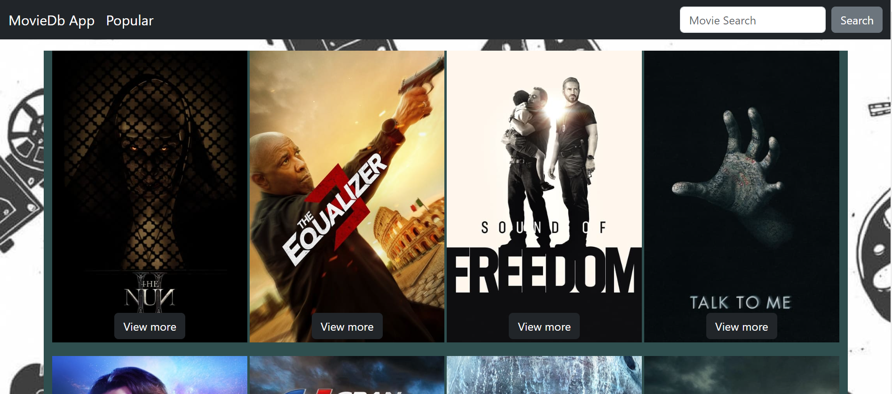

<<<<<<< HEAD

# MOD2-Project

**Task List Web Application**

[a link to the hosted working app](https://mod2-project.onrender.com)

## Introduction

The MoviesDB web application is your go-to platform for exploring and enjoying your favorite movies. This user-friendly app offers a range of features to enhance your movie-watching experience:

Search Movies: Effortlessly find movies by entering their titles or actors' names in the search bar.

View Movie Details: Dive into the world of cinema with comprehensive movie details. Get access to the movie's cover, title, actor information, publication date, intriguing description, and user reviews.

.png>)

## Technologies used

Built with:

- REACT library using Vite
- Bootstrap
- Visual Studio Code
- [TMDB API](https://www.themoviedb.org/)

## Getting Started

To get started with this project, follow these steps:

1. Clone this repository: `git clone https://github.com/LanaSvet11/MOD2-Project.git`
2. Change to the project directory: `cd your-project`
3. Install dependencies: `npm install`
4. Start the development server: `npm start`

## Usage

**Searching for Movies:**

Enter the movie's name or actor's name in the search input field.
Click the "Search" button to find movies related to your query.

**Viewing Movie Details:**

After searching, you'll see a list of movies displayed.
To view more details about a specific movie, click the "View More" button on the movie card.
The detailed view will show you information such as the movie's cover, title, actor, publication date, description, and user reviews.

## Future Enhancements

**Marking a Movie as Favorite:**

When viewing the details of a movie, you can click the "Favorite" button to save the movie to your list of favorites.

**Removing a Movie:**

To remove a movie from the Favorite list, click the "Delete" button next to the movie you want to remove.

## Contributing

Contributions are welcome! If you find any issues or have suggestions for improvements, please open an issue or create a pull request.

## License

This project is licensed under the MIT License. See the [LICENSE file](./MIT%20License.txt) for details.

## Contact

If you have any questions or suggestions, please feel free to contact:

Email: sv.golovatenko@gmail.com
LinkedIn: https://www.linkedin.com/in/svitlana-holovatenko/
=======

> > > > > > > 130b7e1a82a00f355a953e5e71baa9e7d6a0b284
